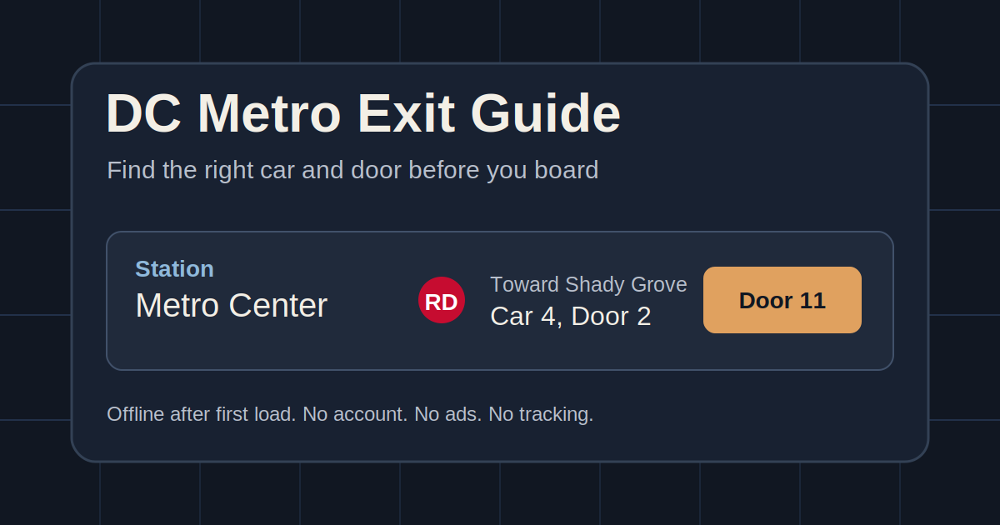

# DC Metro Exit Guide

A fast, offline-friendly DC Metro exit guide. Pick a station, line, and direction, and the app shows the train car and door closest to escalators, stairs, elevators, and other egress points. It is a small, practical tool, not an official WMATA product.

This is for the moment when you are on the platform, the train is arriving, your phone has one bar, and you do not want to discover that your exit is three escalators and half a platform away.

## Live app

[Open the DC Metro Exit Guide](https://wherethejobsat.github.io/DCMetro/)

## Screenshot / preview



## Features

- Search by station name, alternate name, subtitle, or WMATA station code.
- Choose station, line, and direction.
- Shows closest car/door for escalators, stairs, elevators, and other egress points.
- Copy results as plain text.
- Works offline after first load.
- Static site: no server, no account, no ads, no tracking, no runtime WMATA API dependency.

## Why this exists

The 2025 Metro Station Platform Exit Guide is useful, but a phone on a platform is not where you want to pinch, pan, squint, and guess. This app turns that guide into a quick station lookup for DC Metro riders who want to board near the right exit before the train doors close.

## Data and attribution

This project uses 2025 Metro Station Platform Exit Guide/source data from the files in this repo. See [DATA_PROVENANCE.md](DATA_PROVENANCE.md) for what is source material, what is generated, and what is hand-maintained.

Not affiliated with, endorsed by, or maintained by WMATA. Station conditions can change.

## Limitations

- No live elevator/escalator outage status.
- Station layouts and access conditions may change.
- Recommendations assume normal train stopping positions and the source guide's station geometry.
- Open an issue if a recommendation looks wrong.

## Development

The app is a static site generated with Python stdlib scripts. There is no Node toolchain and no Python package install step for the current build.

Build:

```sh
python scripts/build_site.py
```

Validate:

```sh
python scripts/validate_build.py
```

Serve locally:

```sh
python -m http.server --directory docs 8000
```

Then open `http://localhost:8000/`.

`requirements.txt` is not needed for the current build or validation scripts. The site runtime is plain HTML, CSS, JavaScript, a web manifest, and a service worker.

## Contributing

Station corrections, data fixes, and small UX improvements are welcome. For station corrections, include the station, line, direction, exit/elevator/escalator/stair detail, the current app result, the corrected result, and the source or evidence.

## License

Code is licensed under the [MIT License](LICENSE). Code license and underlying data/source-material rights may differ; see [DATA_PROVENANCE.md](DATA_PROVENANCE.md).
